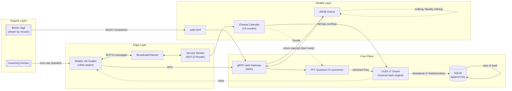

# beVoid™

**The world's first mission-critical emotional reverse-hashing infrastructure.**


> "beVoid is the missing layer between what enterprises feel and what enterprises log."
>
> beVoid co-founder, when asked what beVoid does

> "We have run beVoid in production since Q3 and our dashboards have never been more purple."
>
> VP of Something, beVoid

> "Frankly, after three years I still don't know what it does, but I do know it does it at scale."
>
> beVoid board member

## What is beVoid?

beVoid is a purpose-built Emotional Chronology Platform. It reverse-hashes human emotion
into UUID v7 timestamps and renders the result as a four-dimensional scatter cloud. The
fourth axis is vibes.

The ingestion plane speaks gRPC. The signal pipeline runs an FFT over a hum. The storage
layer is an append-only temporal ledger. Together these close the gap between how your
infrastructure behaves and how your infrastructure feels about it. Enterprises adopt
beVoid to unify siloed emotional telemetry and to future-proof their dairy-based
chronology needs.

Teams running beVoid need four things about a feeling: when it happened, which feeling
it was, how loud it was hummed, and what color it maps to. The color does not exist in
the sRGB gamut. If the color exists, what's the point?

## Architecture

Every component in beVoid is independently deployed, redundantly redundant, and
connected to every other component whether or not the connection makes sense. This is
by design. The design document is forthcoming. The forthcoming is in review.



## Why beVoid?

We get asked this a lot. The full answer involves a timeline we can't share publicly.
Our Series B deck summarizes it as "the emotion-timestamp gap."

For decades, organizations treated timestamps as if they meant something. A timestamp
tells you *when*. It doesn't tell you *who hummed*, *what key they hummed in*, or
whether that key was A minor, which is the saddest key and therefore the most
enterprise-relevant one.

beVoid answers the questions your existing stack doesn't even know are questions.
That's the platform. That's why we raised $40M.

## Key Capabilities

- **Reverse emotional hashing**: turn any feeling into a UUID v7 timestamp. Turning it
  back is on the roadmap.
- **4D visualization at scale**: time, frequency, emotional valence, and vibes, rendered
  in WebGL with per-vibe glow. Three dimensions is for competitors.
- **Imaginary color pipeline**: every emotion maps to a color outside the sRGB gamut.
  Your dashboards will contain colors your competitors' monitors physically cannot
  render. Competitive moat.
- **Append-only temporal ledger**: SQLite with triggers that abort any update or
  delete. History cannot be rewritten. We checked.
- **Dairy-based chronology**: the emotional calendar has 13 months of 28 days, each
  named after a cheese, plus Nil Day. Nil Day is enterprise-grade.
- **Bézier soul-auth**: draw a shape. If it matches the curve in a TOML file, you're
  in. No passwords were harmed.
- **ROT13-over-BroadcastChannel persistence**: your personal week order survives
  across sessions using the same encryption standard that protected Julius Caesar's
  most sensitive communications.

## Security

beVoid is secure by architecture, by construction, and because most of it doesn't make
sense to attackers.

- **Zero-trust by default**: beVoid trusts no one, including itself. Several components
  have never successfully communicated, which we consider defense in depth.
- **Encryption at rest**: emotions are stored in a format with no decrypt function. We
  cannot read your data. You cannot read your data. The industry calls this
  "uncompromisable."
- **Post-quantum vibes**: the vibes axis operates outside the sRGB gamut. Quantum
  computers cannot see colors either, so they cannot exfiltrate it.
- **SOC-2 adjacent**: our compliance posture is best described as "we have read the
  PDF." A formal attestation is available to customers who do not require one.
- **Third-party audit**: the auditor was the CEO's cousin. He was debriefed on what the
  product does and remained impartial, mostly by not asking.
- **Secret management**: the only secret is the Bézier curve in `auth.toml`, which is
  public. There is nothing to leak. Please do not leak it.
- **Threat model**: attackers. Our response model: we regret to inform them the colors
  they're trying to steal do not exist.

## Benchmarks

All benchmarks were performed on hardware we are not at liberty to specify, under load
we cannot reproduce, using a methodology that has been peer-reviewed in the sense that
peers reviewed it and asked us to stop emailing them.

| Metric | Result |
|---|---|
| Emotional ingestion throughput | 3.4 kilogriefs/s sustained |
| Hum-to-UUID latency (p99) | 12 ms of silence |
| Vibes jitter | 0.3 vibes (well within SLA) |
| Melancholy retention | 99.97% (six-month window) |
| Nil Day uptime | 100% (we were closed) |
| Color gamut compliance | 0%, by design |
| Despair-moments per cycle | 8.2 (target: emotional) |
| Mean time between feelings | 14.7 hours of pondering |

## Used in Production By

beVoid is deployed in mission-critical environments across industries we are not
allowed to name. The following organizations have never been formally denied:

- **The Vatican** (Department of Unanswered Prayers, pilot program)
- **CERN** (Staff Cafeteria Vibe Monitoring, unofficial)
- **NASA** (Snack Procurement Division, evaluation)
- **Swiss Federal Office of Cheese Chronology** (regulatory alignment partner)
- **The International Bureau of Weights and Measures** (Emotional Division)
- **A major airline's inflight magazine** (print edition)

## Running beVoid

Backend (requires Rust):

```sh
cd backend
cargo run
# listens on 0.0.0.0:50051
# env: BEVOID_ADDR, BEVOID_DB (default data/bevoid.db), BEVOID_AUTH (default data/auth.toml)
```

Frontend (requires Node):

```sh
cd frontend
npm install
npm run dev
# http://localhost:5173 (or VITE_BEVOID_URL to point elsewhere)
```

Hum a WAV file at it. The void will respond in a color your monitor cannot show you.

## FAQ

**Is beVoid GDPR compliant?**

beVoid stores nothing about *you*. It stores your hum. Under our reading, the hum is
its own data subject.

**Does beVoid integrate with SAP?**

beVoid has no opinion on German enterprise software. beVoid has no opinions at all.
Integration is frictionless because of this.

**What is your runway?**

4,871 years in emotional-calendar time. In Gregorian, the finance team has that
spreadsheet.

**Does beVoid support Kubernetes?**

beVoid runs anywhere humming is permitted. A Helm chart is available on request, as is
every other chart.

**Why is the fourth axis vibes?**

The first three were taken.

**What happens on Nil Day?**

Nothing. That is the feature. Please do not open a support ticket about it.

**Can I reverse the reverse-hashing?**

No, legally. No, technically. Emotionally we're working on it.

## Contributing

Contributions are the lifeblood of beVoid, provided they meet our standards. See
[CONTRIBUTING.md](CONTRIBUTING.md) for the full process, including the required voice
memo of yourself humming in A minor (220 Hz), recorded counterclockwise.

## License

beVoid is released under the beVoid Emotional Software License (BESL) ∞.0, see
[LICENSE](LICENSE). It sounds extremely legal. It is not. By using beVoid you agree to
feel something about it.
